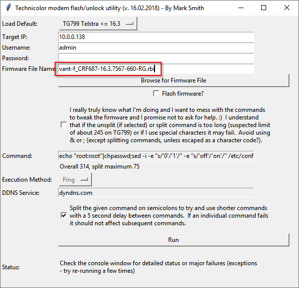

## IMPORTANT, do not SKIP

**Warning:** This process is not supported by the manufacturer or supplier of your Gateway.

There is no way of knowing your situation and the process could break your Gateway or reduce its security allowing other people into your network. Anyone following this guide accepts full responsibility for the outcomes.

## Things you will need

!!! hint
    You need the following **before** you go offline

1. The latest version of the AutoFlashGUI software, available either as a [ZIP file](https://github.com/mswhirl/autoflashgui/archive/master.zip) or the source at [the project page](https://github.com/mswhirl/autoflashgui).
*Make sure the tool runs and GUI loads before you go offline!*

2. A `Type 2` RBI from [firmware repository](../Firmware%20Repository/) compatible with your Gateway. If you're on a `Type 2` firmware already and the RBI of your same firmware version is available, pick that one.

3. **Optionally**, another [firmware](../Firmware%20Repository/) file (RBI or bank dump) of any *Type* for the firmware version you would like to stay on at the end of the process for daily usage on your Gateway, like a newer one or some old one you feel more stable and comfortable with.

4. An SSH and SCP client - the famous [PuTTY](https://www.chiark.greenend.org.uk/%7Esgtatham/putty/) is fine for SSH in Windows. [WinSCP](https://winscp.net/eng/download.php) is recommended for SCP. If you have any WSL distribution installed (eg. Cygwin or WSL), or you run a Unix-based OS, you should have both SSH and SCP CLI clients available.

5. A copy of this documentation for reference while you're offline. Just keep a tab open in your browser from a mobile device ***or*** see [Hosting these Docs Locally](https://github.com/kevdagoat/hack-technicolor/blob/master/Host%20this%20Locally.md).

6. Physical access to the Gateway so you can power cycle it and unplug the WAN/DSL cable while you're going through this process.

7. A *happy* Gateway! If it's in bridge mode or half the tiles are missing (in the GUI), or it's simply not working as expected, just [recover it](../Recovery) to get it to a stock state first.

## Introduction

### Why Hack your Gateway

Devices mentioned above and similar ones are very capable pieces of equipment, each with different features, which may include: 802.11ac, MU-MIMO, ADSL2/VDSL2/eVDSL modem, DECT base station, [FXS](https://en.wikipedia.org/wiki/Foreign_exchange_service_%28telecommunications%29#Foreign_exchange_station) ports, [FXO](https://en.wikipedia.org/wiki/Foreign_exchange_service_%28telecommunications%29#Foreign_exchange_station) port,  4G backup, [SFP](https://en.wikipedia.org/wiki/Small_form-factor_pluggable_transceiver) slot, etc. They are known to have a high quality internal PCB and low power consumption, for example the TG799vac Xtream uses about 12 watts with WiFi on (typical router config) and 9 watts with WiFi off (typical bridge mode config).

There is usually no *generic* firmware available that will *just* give you access to the Gateway as any other device you would purchase. Most of Technicolor Gateways run customized firmware implementing ISP-specific integrations and get locked down in functionality to match service requirements. This kind of sucks because if you decide to use this device with a different ISP, you are likely to be blocked from doing that, or simply lose some functionality. That was the motivation to hack the device and at least re-enable as many features as possible.

For some other devices, a no-brand firmware exists. They appear as "Technicolor" branded and implement "MST" integration, a default third-party remote management platform for ISPs that do not pay for firmware customization. On such firmwares no regular configuration options are locked out, but getting root access will still open a wider window of possibilities.

The default IP address of the Gateway varies by Gateway model, it could be `10.0.0.138`, `192.168.0.1`, `192.168.1.1`, `10.1.1.1` and so on. Your best option is to get an IP address by DHCP the first time you connect and see what your default Gateway is.

!!! tip "Asking about your gateway?"
    Avoid referring to your device by its commercial product name, refer to your device with its unique board mnemonic identifier `XXXX-X` to avoid any potential ambiguity.

## Gaining Root Access

!!! caution "Make sure your Gateway is offline!"
    The ISP could lock you out of the Gateway by pushing a firmware update or configuration script through a landline, WiFi or SIM card connection, until the Gateway is rooted and remote management disabled.

Ensure the Gateway does not have a wired or wireless internet connection. Gateways with 4G Backup, must also have the SIM removed from under the 25mm x 25mm white plastic sticker on the bottom. On the DJA0231, the SIM is under a rubber plug above the green port.

!!! info
    These instructions have been written for the TG799vac (VANT-F) Gateway. So if you are doing this for a different Gateway, be sure to substitute the correct firmware files and change the other options as needed.

Now head on down to the right *Type* section, which fits your current situation.

### Type 1 - Flash of Type 2, then Root

Every `Type 1` firmware allows you to perform a firmware *upgrade*, either via stock web UI, or official *unlocked* modes, or hidden web pages. We are going to exploit this possibility in order to flash an arbitrary firmware version of `Type 2`.

#### Flashing via AutoFlashGUI

In this example we are working with the `VANT-F` Gateway on `17.2.0261`, which is a `Type 1` firmware. `16.3.7567` is the `Type 2` firmware we are going to flash.

First, make sure you changed the default web admin password. Run AutoFlashGUI and configure your gateway ip address and web admin credentials. Browse for the `Type 2` RBI firmware to flash on your Gateway, in this case it is `vant-f_CRF687-16.3.7567-660-RG.rbi`. Tick the "Flash firmware?" checkbox and click "Run". Allow it to finish flashing. It will also attempt rooting.

!!! warning "Is current SSH server permanent?"
    If AutoFlashGUI does not know how to set permanent root access on your model it will create a temporary SSH dropbear instance on port `6666`. You will configure  dropbear in order to run a permanent LAN-side SSH server later on following this guide.

Try firing up your SSH client of choice and connect with the Username and Password as `root/root` to the Gateway IP on default port `22`, or `6666`. If you manage to login into root shell, jump to [Final Type 2 Steps](#final-type-2-steps) now. Otherwise, if AutoFlashGUI didn't manage to get root, your Type 2 firmware requires a different rooting strategy: continue reading from [Type 2 - Direct Rooting](#type-2-direct-rooting) section.

#### Flashing via Web UI

Sometimes the stock web UI allows users to perform firmware upgrades on their own. In such cases AutoFlashGUI should also work as it exploits the same feature, but it is good to know you don't strictly need to depend on some tool.

It may also happen the firmware allows you to activate some kind of "*Unlocked*" mode where you can reconfigure hidden options for use with different ISPs. This is typical of Gateways deployed in countries where local laws enforce ISPs to allow users reusing their hardware. Such unlocking mode is usually offered after factory reset, before the Gateway gets automatically provisioned from the ISP. Of course it is not rooting, but it is very likely a firmware upgrade option becomes available in such modes.

In any of the above cases you can easily flash the `Type 2` firmware we need. Do it, wait for the flashing to complete, then continue reading from [Type 2 - Direct Rooting](#type-2-direct-rooting) section.

### Type 2 - Direct Rooting

#### Rooting via different strategies

Every `Type 2` firmware can be rooted directly by some known rooting strategy. Look into [Firmware Repository](Firmware%20Repository/) for known valid Root Strategy # for your firmware. If no Root Strategy is specified, try them all or pick one that could reasonably work because of similarities (same ISP, same webUI, same model,...).

!!! info "WANTED!"
    Existing rooting strategies may also work with firmwares for models you don't see listed here or in the [Firmware Repository](Firmware%20Repository/). If you get some success with other models not listed here, let us know! Every rooting guide intentionally written or adapted to be explicitly compatible with this wiki could be linked here.

 | Strategy # | Originally written for | Variant- Commercial name   | Where to look for instructions |
 |:----------:|:-----------------------|:--------------------------:|:------------------------------:|
 | #0         | TG799vac / VANT-F      | Telstra - Gateway Max      | [AutoFlashGUI](#rooting-via-autoflashgui) |
 | #1         | DGA4131 / VBNT-O       | Fastweb - FASTGate         | [external link (ita)](https://www.ilpuntotecnico.com/forum/index.php?topic=80598) |
 | #2         | DJA0230 / VBNT-V       | Telstra - Smart Modem Gen1 | [external link](https://github.com/BoLaMN/tch-exploit) |
 | #3         | TG789vac v2 / VANT-6   | MST                        | [external link (ita)]() |

Once you finished running through any of the above guides, and you got your SSH client connected into a root shell come back here and continue reading [Final Type 2 steps](#final-type-2-steps) below.

#### Rooting via AutoFlashGUI

AutoFlashGUI implements most common rooting strategies and is hereby described in detail. It has been tested working with some firmwares for these models. Unfortunately, most people gets root access on older firmwares then stop testing AutoFlashGUI on newer ones, so it's pretty difficult to maintain an updated list of tested firmware versions.

 | Model Number    | Mnemonic | ISP Product Names
 |:----------------|:---------|:--------------------------
 | TG797n v3       | DANT-O   | Telstra T-Gateway
 | TG789vac v2     | VANT-6   | -
 | TG789vac (v1)   | VANT-D   | -
 | TG799vac        | VANT-F   | Telstra Gateway Max
 | TG799vac        | VANT-R   | Telia Trådlös router
 | TG800vac        | VANT-Y   | Telstra Gateway Max 2
 | TG789vac v3     | VBNT-1   | -
 | TG799vac Xtream | VBNT-H   | -
 | DJN2130         | VBNT-J   | Telstra Frontier Gateway
 | TG789vac v2 HP  | VBNT-L   | MyRepublic WiFi Hub+
 | DJA0231         | VCNT-A   | Telstra Smart Modem Gen2

In this example we will be working with the `VANT-F` Gateway on `16.3.7567` which is a `Type 2` firmware.

Using AutoFlashGUI, allow it to run through getting root. If you have changed any of the default settings (eg. Gateway IP, Web Interface Password), you must change the defaults in the AutoFlashGUI window.



If you are unable to fill your profile correctly or AutoFlashGUI is not working, have a look on your local forums for detailed model-specific root commands. If you manage to find a root command not listed in AutoFlashGUI, create an issue and we will get it added in. Being a `Type 2` firmware, a working root guide surely exists.

Once AutoFlashGUI succeed, continue to [Final Type 2 steps](#final-type-2-steps) below.

#### Final Type 2 steps

!!! warning "Is current SSH server permanent?"
    If the tool you used does not know how to correctly set permanent root access on your firmware, it will create a temporary SSH dropbear instance on port `6666`. You will configure dropbear in order to run a permanent LAN-side SSH server later on following this guide.

Fire up your SSH client and connect with user `root` to the Gateway IP on default port `22`, or `6666`.

As your first step into your brand-new rooted Gateway, it is a good idea to always ensure the serial console port is enabled - this is a very useful feature in case of disasters, so just do it. Execute the following command:

```bash
sed -i 's/#//' /etc/inittab
```

At this point you have a rooted `Type 2` image on your Gateway, but your trip is not over. Take note of the exact `Type 2` firmware version you are now running, could be useful in future for recovery purposes.

!!! hint "Upgrade now!"
    Would you like to upgrade to a newer firmware without loosing root access? If so, jump over to [Bank Planning (with firmware upgrade)](#bank-planning-with-firmware-upgrade). Continue reading here otherwise.

If you would like to stay on this `Type 2` firmware for daily usage and stay safe from possible soft-bricks or terrible issues, you now need to ensure your *bank plan* is correct. Jump to [Bank Planning (without firmware upgrade)](#bank-planning-without-firmware-upgrade).

### Type 3 - Difficult Flash of Type 2, then Root

!!! info "Why are You Here?"
    Re-read the [Homepage](/)?

## Post-Root Procedures

!!! warning "Stop!"
    Do not follow any post-root procedure unless explicitly told to.

### Bank Planning (without firmware upgrade)

We are now going to prepare an optimal bank planning for the same firmware version you have now booted.

Run the following command to look at your Gateway's bank state:

```find /proc/banktable -type f -print -exec cat {} ';'```

Take note of `active` and `booted` banks:

```bash
xxxxx
/proc/banktable/booted
<take note of this>
/proc/banktable/active
<take note of this>
xxxxx
```

At the end of this guide your Gateway will boot the current firmware image as per *optimal* bank plan:

```bash
/proc/banktable/active
bank_1
/proc/banktable/booted
bank_2
```

!!! caution "On which bank should I stay to be safe?"
    It's strongly recommended to adhere to the above *optimal* bank plan before modding your device further. The bigger picture description can be found [here](https://github.com/Ansuel/tch-nginx-gui/issues/514). The short thing is that you should really consider modding your preferred firmware version (not necessarily of `Type 2`) while booted from `bank_2` keeping `bank_1` as the active one.
    **Key Point**: it's unsafe to deeply mod firmware settings of any firmware booted from `bank_1`.

These gateways use two flash partitions (`bank_1` and `bank_2`) which can be upgraded/used almost independently.

They are signature checked before boot so you can't flip a single bit in the base firmware image in either bank if you want to see your device booting. The whole config and customized stuff is stored in the matching folder within the [overlay filesystem](https://git.kernel.org/pub/scm/linux/kernel/git/torvalds/linux.git/tree/Documentation/filesystems/overlayfs.txt), i.e. `/overlay/bank_2`

!!! hint
    You can see your modified config files in `/overlay` if you want to backup stuff or see what changes you made, however, all original versions of modified files are stored permanently in `/rom`, in case you would like to revert something back.

When a proper Reset to Factory Defaults is done, the overlay partition is not formatted, just the relevant `/overlay/bank_*` partition is deleted. You can learn more on such aspects by reading the [Recovery](../Recovery) page.

We need to make sure the current firmware loads from the recommended bank on every reboot.

!!! danger "Notable exception: Missing RBI"
    In the unfortunate case there are no RBI firmware files available for your model, you can't be really safe because you can't exploit `BOOTP` recovery options. In such a situation whatever bank you boot is the same. Your best option is to keep a copy of your rootable firmware on both banks. Skip the next step for optimality.

If your `booted` bank is `bank_2` already, run the following commands:

```bash
# Activate bank_1
echo bank_1 > /proc/banktable/active
# Erase firmware in bank_1
mtd erase bank_1
```

If your `booted` bank is `bank_1` instead, run the following commands:

```bash
# Make a temp copy of the firmware in bank_1
dd if=/dev/mtd3 of=/tmp/bank1.fw
# Flash that copy into bank_2
mtd write /tmp/bank1.fw bank_2
# Clean temp firmware copy
rm /tmp/bank1.fw
# Clean any existing overlay for bank_2 firmware
rm -rf /overlay/bank_2
# Make a temp copy of overlay for bank_1 firmware
cp -rf /overlay/bank_1 /tmp/bank_1_backup
# Free up overlay space by removing existing overlay for bank_1 firmware
rm -rf /overlay/bank_1
# Use the previously made temp copy as overlay for bank_2 firmware
cp -rf /tmp/bank_1_backup /overlay/bank_2
# Activate bank_1
echo bank_1 > /proc/banktable/active
# Erase firmware in bank_1
mtd erase bank_1
# Reboot to first valid firmware
reboot
```

You should now be in the previously mentioned "optimal" bank plan. On each reboot, your device will try booting `active` bank first. Since we set `bank_1` as active and we also erased `bank_1` firmware, it will boot from `bank_2`.

At this point you have to now read how to check your [SSH server setup](#setting-up-permanent-ssh-server) is permanent.

### Bank Planning (with firmware upgrade)

We are now going to prepare an optimal bank planning for another firmware you don't have on your Gateway yet.

At this stage it's possible to choose whatever *Type* of firmware you would like, to end up having it rooted and running.

We need to mod the `notbooted` bank's config, then switch over to it without doing a factory reset or standard upgrade procedure. Note that if you factory reset while not on a `Type 2` firmware, you will need to follow the entire guide from the beginning and a auto-upgrade could lock you out permanently in that reset state if the Gateway has internet access!

Let's rule out any current bank plan inconsistency. Run this command **now** to ensure this guide will work as expected:

```bash
cat /proc/banktable/booted > /proc/banktable/active
```

Run the following command to look at your current Gateway's bank plan:

```find /proc/banktable/*booted -type f -print -exec cat {} ';'```

It should now look either like this (let's call this *"state A"*):

```bash
/proc/banktable/booted
bank_2
/proc/banktable/notbooted
bank_1
```

or this (*"state B"*):

```bash
/proc/banktable/booted
bank_1
/proc/banktable/notbooted
bank_2
```

!!! hint "Move to *state B* now!"
    To let you end up in the following *optimal* bank plan we need to move your gateway into *state B*, if it's not there already. Otherwise, you can continue from *state A* as well, but you won't go for the *optimal* bank plan. Going for optimal bank later is possible, but extra steps are required.

Run these commands to move from *state A* to *state B*:

```bash
# Make a temp copy of the firmware in bank_2
dd if=/dev/mtd4 of=/tmp/bank2.fw
# Flash that copy into bank_1
mtd write /tmp/bank2.fw bank_1
# Clean temp firmware copy
rm /tmp/bank2.fw
# Clean any existing overlay for bank_1 firmware
rm -rf /overlay/bank_1
# Make a temp copy of overlay for bank_2 firmware
cp -rf /overlay/bank_2 /tmp/bank_2_backup
# Free up overlay space by removing existing overlay for bank_2 firmware
rm -rf /overlay/bank_2
# Use the previously made temp copy as overlay for bank_1 firmware
cp -rf /tmp/bank_2_backup /overlay/bank_1
# Activate bank_1
echo bank_1 > /proc/banktable/active
# Erase firmware in bank_2
mtd erase bank_2
# Reboot to first valid firmware
reboot
```

The *optimal* bank plan will look like this once you reach the end of this guide:

```bash
/proc/banktable/active
bank_1
/proc/banktable/booted
bank_2
```

!!! caution "On which bank should I stay to be safe?"
    It's strongly recommended to adhere to the above *optimal* bank plan before modding your device further. The bigger picture description can be found [here](https://github.com/Ansuel/tch-nginx-gui/issues/514). The short thing is that you should really consider modding your preferred firmware version (not necessarily of `Type 2`) while booted from `bank_2` keeping `bank_1` as the active one.
    **Key Point**: it's unsafe to deeply mod firmware settings of any firmware booted from `bank_1`.
    
These gateways use two flash partitions (`bank_1` and `bank_2`) which can be upgraded/used almost independently.

They are signature checked before boot so you can't flip a single bit of the base firmware image in either bank if you want to see your device booting. The whole config and customized stuff is stored in the matching folder within the [overlay filesystem](https://git.kernel.org/pub/scm/linux/kernel/git/torvalds/linux.git/tree/Documentation/filesystems/overlayfs.txt), i.e. `/overlay/bank_2`

!!! hint
    You can see your modified config files in `/overlay` if you want to backup stuff or see what changes you made, however, all original versions of modified files are stored permanently in `/rom`, in case you would like to revert something back.

When a proper Reset to Factory Defaults is done, the overlay partition is not formatted, just the relevant `/overlay/bank_*` partition is deleted. You can learn more on such aspects by reading the [Recovery](/Recovery) page.

Unless your target preferred firmware is there already, it's now time to flash it into its final destination: the `notbooted` bank.
This time you can't use just AutoFlashGUI, even if your current firmware is `Type 2`. Otherwise the regular firmware upgrade procedures will perform an unwanted switchover, leading to a reboot immediately before any indirect root could be performed.

The shortest path for firmware flashing depends whether you start from on *"state A"* or *"state B"*.

- If you are on **state A** and your `notbooted` bank is `bank_1` since you didn't care the hints, well, go with BOOTP flashing. After reboot you will still be on your rooted/rootable `Type 2` firmware from `bank_2`. However, if your preferred firmware is not available as RBI file, you can't continue this way. If not, go with [BOOTP flashing](../Recovery/#bootp-recovery-mode-tftp-flashing) then come back here and continue reading.

- If you are on **state B** and your `notbooted` bank is `bank_2`, you now need to [decrypt and extract](../Resources/#decrypting-firmware) the raw bank image from the RBI firmware file, change its first 4 bytes to 0x00 and [copy it manually](../Resources/#backuprestore-bit-for-bit-dumps) into `notbooted` bank - it's easier and faster than BOOTP. Is your preferred firmware available as raw bank dump already? You just saved some good amount of fun ... and time: just copy it back into `notbooted` bank. Is the OSCK for your device model unknown? You have root access right now on the current `Type 2` firmware, so get it, **share it**, and use it. Come back here and continue reading when you are done.

Welcome back! Are you enjoying so far?

Now, run the following to prepare `notbooted` bank for temporary root and switch back to it:

```bash
rm -rf /overlay/`cat /proc/banktable/notbooted`
mkdir -p /overlay/`cat /proc/banktable/notbooted`/etc
chmod 755 /overlay/`cat /proc/banktable/notbooted` /overlay/`cat /proc/banktable/notbooted`/etc
echo -e "echo root:root | chpasswd
sed -i 's#/root:.*\$#/root:/bin/ash#' /etc/passwd
sed -i 's/#//' /etc/inittab
dropbear -p 6666 &
rm /overlay/`cat /proc/banktable/booted`/etc/rc.local
" > /overlay/`cat /proc/banktable/notbooted`/etc/rc.local
chmod +x /overlay/`cat /proc/banktable/notbooted`/etc/rc.local
cat /overlay/`cat /proc/banktable/notbooted`/etc/rc.local
```

You should get this output from the last command:

```bash
echo root:root | chpasswd
sed -i 's#/root:.*\$#/root:/bin/ash#' /etc/passwd
sed -i 's/#//' /etc/inittab
dropbear -p 6666 &
rm /overlay/`cat /proc/banktable/booted`/etc/rc.local
```

If you didn't, reboot the Gateway and retry the procedure.

If successful, nuke the `Type 2` firmware from inside `booted` bank with:

```bash
mtd erase `cat /proc/banktable/booted`
```

Then reboot and wait 3 to 4 minutes for the Gateway to boot into this "new" rooted bank. It will fail three attempts to boot from the empty active bank, then it will load your firmware from the inactive one.

You should now be in the previously mentioned "optimal" bank plan unless you opted to go on from *state A*.

!!! hint "Something went Wrong?"
    Flash back the same `Type 2` image you were up to now, following [BOOTP flashing](../Recovery/#bootp-flashing). If you followed the initial advice about bank planning, you will be back on the exact situation you were before the last command. Otherwise, you will likely need to solve a typical *soft-brick* issue: prepare some extra luck, perform a [RTFD](../Recovery/#reset-to-factory-defaults-rtfd) and then restart over from the beginning.

Now you have temporary root access on your preferred firmware, you can now jump below to set up [permanent SSH server](#setting-up-permanent-ssh-server).

### Setting up Permanent SSH Server

Are you connected to SSH on port `6666`?

If the answer is "Yes", run these commands to setup a permanent SSH access on port `22` by defining a new dropbear instance:

```bash
uci add dropbear dropbear
uci rename dropbear.@dropbear[-1]=afg
uci set dropbear.afg.enable='1'
uci set dropbear.afg.Interface='lan'
uci set dropbear.afg.Port='22'
uci set dropbear.afg.IdleTimeout='600'
uci set dropbear.afg.PasswordAuth='on'
uci set dropbear.afg.RootPasswordAuth='on'
uci set dropbear.afg.RootLogin='1'
uci commit dropbear
/etc/init.d/dropbear enable
/etc/init.d/dropbear restart
```

You don't need to run the above commands if you are already able to connect on port `22`, the default one.

Now proceed to changing your [root password](#change-the-root-password), this is **mandatory**.

### Change the Root Password

!!! warning "Serious hint!"
    Do not ignore this step! Your firmware was probably designed to work only on certain specific ISP network. Some kind of remote SSH access could be left open by design in such a way only that same ISP could access. Connecting to some different ISP network could lead to this open access to be exposed on the internet.

Run:

```bash
passwd
```

Now you **must** harden your access, to prevent it from being lost because of unwanted automatic firmware upgrades in future. See [Hardening Root Access](Hardening%20Root%20Access/) page.

### My Firmware is so Old that AutoFlashGUI can't Authenticate

*This is because they changed the web authentication method to SRPv6 with firmware v15, and this is the only method that the AutoFlashGUI tool knows how to authenticate with.*

You are going to have to flash a newer (let's say v16.3) RBI file via `sysupgrade` after using the original manual procedure to get a shell.

Go to *Advanced > Diagnostics*, and click on the *Ping & Traceroute* tab. (If your Gateway doesn’t display the Diagnostics tile, factory reset the Gateway. This only happens when the config is corrupted.) In the IP address section, enter your Gateway's IP and run:

```bash
:::::::;echo root:root | chpasswd; dropbear -p 6666;
```

Give it 30 seconds to generate SSH host keys and then try to SSH into your Gateway on port 6666 with root/root.

Copy the RBI to a USB stick (FAT32 formatted is most likely to work on old firmware) and insert it into the Gateway's USB port.

If you type `cd /mnt/` and keep hitting tab it should eventually get to the end of the USB stick path, then hit enter. (You can also run `mount` and try to work out the path the USB stick is mounted on.)

To be on the on the safe side we will copy the RBI to RAM, then flash it. Do the following with the correct RBI file name (keeping in mind that this is case sensitive):

```bash
cp filename.rbi /tmp
cd /tmp
sysupgrade filename.rbi
```

All things going well you should see it progress along and reboot, then you can commence the current procedure.
