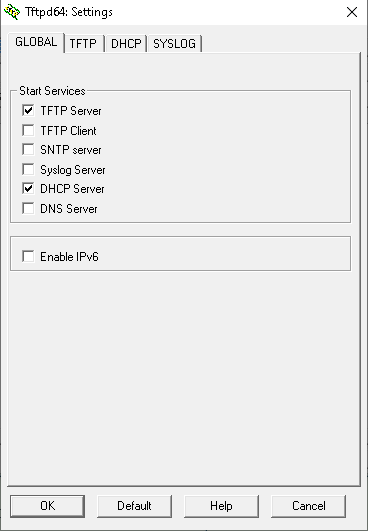
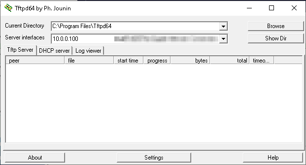
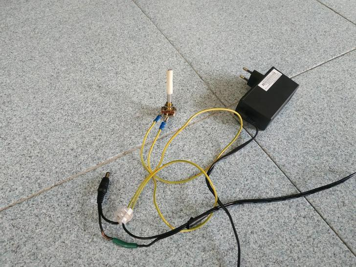

# Recovery

## IMPORTANT, do not SKIP

**Warning:** This process is not supported by the manufacturer or supplier of your Gateway.

There is no way of knowing your situation and the process could break your Gateway or reduce its security allowing other people into your network. Anyone following this guide accepts full responsibility for the outcomes.

!!! caution "DISCLAIMER"
    In some cases there is no way of knowing your exact situation and taking the wrong actions could make things worse, potentially leading to a bricked Gateway. Anyone following this guide accepts full responsibility for the outcome(s).

This Guide is based on a few different states.

## Recovering gateways on optimal bank plan

If you followed rooting guides from this Wiki, you were suggested to implement the so called *optimal* bank plan.

!!! note "This recovery method is **not** available if..."
    - You are not or no more on *optimal* bank plan
    - Your `/overlay/bank_1` contents is messed up
    - Your active bank is `bank_2`
    - There are no RBI firmware images of `Type 2` available for your board

Recovery from any bad state (**excluding full overlay partition issues**) while *optimal* bank plan is in place, always consists in following this path:

1. Use [BOOTP flashing](#bootp-flashing) to flash a valid `Type 2` firmware for your board. Because of *optimal* bank plan, the Gateway is guaranteed to boot this sort of *recovery disk* from `bank_1`. The `Type 2` image you choose to pick now for recovery purposes does not depend on which one you have in `bank_2`. If this is not your first time booting this *recovery disk*, choose the same `Type 2` firmware you used in past.
2. Being on *optimal* bank plan your `/overlay/bank_1` is assumed to be in a good shape as whatever you work on daily is inside `/overlay/bank_2` instead. For that reason the gateway will boot just fine the image you just flashed. Fire up your SSH client and get in the root shell. If this is your first time booting this *recovery disk* you will need to hack it following [Type 2 rooting](../Hacking/Type2/#type-2-direct-rooting) instructions stopping just before [Post-Root Procedures](../Hacking/Type2/#post-root-procedures).
3. Whatever was wrong and causing issues with your mods related to the firmware you were booting from `bank_2` is now inside `/overlay/bank_2` folder. Fix it manually if you know what was your mistake, otherwise restore `/overlay/bank_2` folder contents from a previous overlay backup. If you didn't get any (shame on you) forget about whatever you were running from `bank_2`, jump to and go through [Post-Root Procedures](../Hacking/Type2/#post-root-procedures) to the end as if it were the first time you read that page, do not come back to this recovery guide.
4. When you have finished, go back booting form `bank_2`: run `mtd erase bank_1` to eject this *recovery image* and reboot.

!!! warning "DO NOT..."
    * Do not switch active bank, it always has to be `bank_1`
    * Do not apply any mod except root access while booting the *recovery disk*
    * Do not try RTFD or bootfail

!!! note "What if my overlay partition is full?"
    *Optimal* bank plan is not intended to make things easier in such cases. You can still try booting recovery as explained above and [wipe the filled up partition](#wipe-custom-data-partition) as soon as you get a root shell. Expect something in the above step 2 to go wrong: either your *recovery disk* doesn't boot fine (bootloops) since something running upon startup is crashing because of file writing failures, or you can't get root access because root strategies fail to apply needed changes. Your chances to sort out from this situation are bigger if this is not the first time booting into recovery since everything usually created upon startup and root access is there already.

## Wipe Custom Data Partition

Technicolor Gateway platforms are usually built on a `firmware + data` design, which consists of read-only filesystems (squashfs) stored in *flash banks* plus a writable filesystem (jffs2) for user dafa storage.

In modern Homeware firmware's, based on a fork of OpenWrt (Chaos Calmer 15.05), the user data partition is an overlay, it's contents get applied on top of the root filesystem, which is stored as read-only firmware in the booted bank. For dual-bank gateways, the user data partition contains a differing overlay for each firmware bank.

The space available in the the user data partition is shared across both bank's overlay's.

If you think you are not completely aware of what's going on or you don't know what you did wrong, it is strongly recommended you just completely **wipe the user data partition only** as follows, which will wipe all custom config.

!!! note "This reset method is **not** available if..."
    - You have lost any kind of access to root shell by either SSH, Telnet, or Serial console, and you cannot execute a custom command as root.
    - The Gateway bootloops or fails to boot properly.

1. Log in to root shell (whatever you have available to you; SSH, telnet, serial console ...)
2. Run `cat /proc/mtd` and look for your user data partition name, it could be either `userfs` on older devices, or `rootfs_data` on newer ones
3. Run `mtd -r erase rootfs_data` or `mtd -r erase userfs` accordingly.

## Reset to Factory Defaults (RTFD)

If at some point you can no longer connect to the Gateway or you want to make a fresh install, it may be useful to perform a *Reset to Factory Defaults (RTFD)*.

!!! note
    A RTFD deletes all changes you made to files and configurations on the booted bank. After the reset, a reconfiguration and a reroot of your Gateway **will** be needed.

This feature is implemented by an official tool from Technicolor you can invoke in different ways. Choose between:

1. RTFD via the web interface
2. RTFD via the reset button
3. RTFD via the CLI (shell)

!!! caution "Unroot prevention may break RTFD"
    Procedures and guidelines found in this wiki won't break ordinary RTFD functionality. However, some heavy mods, like the custom tch-nginx-gui, also install modded RTFD scripts to prevent loosing root access on RTFD, and this means RTFD may also fail. These scripts are also designed to survive after RTFD. This means you can't get rid of them by doing RTFD. If the Gateway had one of these mods installed and RTFD does not work for you, then check the mod details.

### RTFD via the web interface

!!! note "This RTFD method is **not** available if..."
    - The web interface is corrupt and not accessible.
    - The Gateway bootloops or fails to boot properly.
    - The `userfs` or `rootfs_data` jffs2 filesystem is full.

1. Browse to the Gateway web interface.
2. Click Gateway. The Gateway page appears.
3. Click Reset.
4. The Gateway deletes all customized data for the booted bank and restarts.

### RTFD via the Reset Button

!!! note "This RTFD method is **not** available if..."
    - The physical reset button of the Gateway have been disabled.
    - The Gateway bootloops or fails to boot properly.
    - The `userfs` or `rootfs_data` jffs2 filesystem is full.

1. Make sure the Gateway is turned on and completely booted.
2. Push the Reset button for at least 7 seconds and then release it.
3. The Gateway will delete all customized data for the booted bank. You will need to reroot.

### RTFD via the CLI shell

!!! note "This RTFD method is **not** available if..."
    - You have no access to the CLI by either SSH, or Telnet, or serial console.
    - The Gateway bootloops or fails to boot properly.
    - The `userfs` or `rootfs_data` jffs2 filesystem is full.

1. Make sure the Gateway is turned on and completely booted.
2. Login to the CLI (RTFD is also available in restricted shell if needed).
3. Run `rtfd`
4. The Gateway will delete all customized data for the booted bank. You will need to reroot.

### Manually do what RTFD does

!!! note "This reset method is **not** available if..."
    - You have no access to the root shell by either SSH, or Telnet, or serial console.
    - The Gateway bootloops or fails to boot properly.
    - The `userfs` or `rootfs_data` jffs2 filesystem is full.

1. Make sure the Gateway is turned on and completely booted.
2. Login to root shell.
3. Run `rm -rf /overlay/bank_N`
    - Where **N** is either number of the bank you want to RTFD.
4. Turn off device to reboot. You will need to reroot.

### Restore your settings

If you previously backed up your configuration, you can now restore it to your Gateway.

## BOOTP flashing

This guide is useful if you need to load a different firmware on your `bank_1` firmware partition, in case of a downgrade or replace a corrupt one.

!!! note "Your firmware is unlikely to be corrupt!"
    - If your Gateway stopped working normally after some mods or tweaks, it is very unlikely you messed up the firmware partitions since all your mods and settings are stored in the `userfs` or `rootfs_data` partition instead. Reloading a firmware in such situations won't make any difference unless you load a different version which is known to somehow work fine enough with your messed up mods & settings.

This should work for any known Technicolor device build on a Broadcom BCM63xx platform. Since basically forever, Technicolor gateways have had a corrupt firmware recovery mechanism built in.  

By holding down a button (usually reset) at power on, the Gateway will enter BOOTP mode which will allow you to flash firmware into `bank_1`, while the appropriate software is running on your PC

If both firmware banks contain invalid firmware's, the Gateway will enter BOOTP mode automatically after three failed boot attempts on both banks.

!!! warning "Please note and take into account"
    - This **will not** automatically **switch** the active bank for you, if the active bank is `bank_2` and it still contains a valid firmware it will still boot it, instead of the one you are flashing here.

    - Flashing via this method **does not** perform any factory **reset**, the new firmware will run on old and possibly corrupt or incompatible config. It is therefore recommended that you perform a factory reset before flashing a new firmware.

    - The firmware BLI image (.bli/.rbi files) is digitally signed, and the signature is verified by BOOTP before flashing, so you can't flash an incorrect image (a good thing) but you also can't load a modified image (sad face times 1000).

### Set up TFTP

This guide is written for Windows but it should work on Linux too if you adapt the configuration.

What you will Need

1. A computer running a DHCP server and TFTP server.
   This guide uses TFTP64 for windows which implements both.

2. RBI firmware file for your specific Gateway board.

3. A wired ethernet connection with static IP address assigned.
   BOOTP recovery mode does not support Wi-Fi.

4. A few cups of coffee

5. About 30min to an hour

### Setting up the Server

1. Download the latest normal edition of [TFTP64](http://tftpd32.jounin.net/tftpd32_download.html) and install it.

2. Get the [firmware](../Repository/) (RBI) file you want to load into the Gateway and place it in the TFTP64 folder. You may use another folder and change the settings appropriately if you wish.

3. Connect the Ethernet port on your PC to one of the LAN ports on the Gateway (usually LAN1).

4. Turn the Gateway off.

5. On the PC ensure the network card you wish to use is set to DHCP

    - Press Windows+R to run `ipconfig /all | find "DHCP Enabled"` or check multiple cards with `ipconfig /all`. [Microsoft help page](https://support.microsoft.com/en-us/help/15089/windows-change-tcp-ip-settings). (Unless you are using Static IPs on your network this will already be done.  After the next few steps, the network card will receive an address from the TFTPD64 DHCP server.)

6. Start TFTP64.

7. Click Settings.

8. On the GLOBAL tab enable only the following: TFTP Server, DHCP Server.

    

9. On the TFTP tab the default options should be OK (base directory should be `.`)

    

10. On the DHCP Server tab:

    - IP pool start address: `10.0.0.100`

    - Size of pool: `20`

    - Boot file: the firmware filename to flash i.e. `vant-f_CRF687-16.3.7567-660-RG.rbi`

    - Def. Router (Opt 3): `10.0.0.99`

    - Mask (Opt 1): `255.255.255.0`

    

11. Click OK

12. Click *Accept* when prompted to restart.

13. On the main screen Change the *Server Interfaces* selection to your Ethernet network card.

14. Close TFTPD64.

15. Re-open TFTPD64.

16. If you get a firewall warning, allow access on both private **and public** networks. Please note the temporary network between your PC and device in BOOTP mode will always be of public type by default.

    - If you don't get any firewall warning and you don't remember if you have already allowed access for TFTP64 in past, please, check firewall settings to confirm it's allowed already or temporally disable firewall.

    The server interface should now show an IP in the 10.0.0.x range and after a few seconds, the PC gets an IP from the TFTP64 program via DHCP.

    

You are now ready to try booting the Gateway to do the flash!

### Flashing the Firmware

1. Set up TFTP to send firmware in BOOTP mode [as described above](#set-up-tftp) or in [this guide](https://www.jonathandavis.me.uk/2013/12/flashing-generic-firmware-on-a-technicolor-tg582n/).

2. Ensure TFTP is on the log viewer tab.

3. Connect one end of the network cable to any LAN port on the Gateway, DO NOT use the WAN port, and the other end to the nic on the pc.

4. Place Gateway into BOOTP mode, this is achieved by turning it off, holding the reset button down and powering on.
    - For TG789vac and TG799vac wait for the ethernet light to flash.
    - For TG800vac count to about 5.
    - TFTP may detect the sooner though.

5. Let the firmware flash, a download progress bar will show. When completed, the Gateway will start flashing the received firmware. Wait for the Gateway to reboot.
    - It may take a few attempts for TFTP to connect and send the firmware, and you may have to put the Gateway into BOOTP mode again if you send no firmware's for a while.

6. After Gateway has rebooted, wait for approx 4-10min.

From here, Gateway has the firmware you flashed into its `bank_1` partition.

!!! note "A few things to note"
    - Again, the Gateway will not boot from this new firmware if `bank_2` is active and contains a valid firmware. Would you like to force it booting from `bank_1` instead? Read below chapters.

    - TFTP does not always play nice & may require a few loads to get working, as well as mentioned above, BOOTP mode can be a pain.

    - This guide and process will not work if your device is bricked at bootloader stage.

    - If you did not perform RTFD for `bank_1` before TFTP flashing and the new firmware is not fully compatible with previous one, you may now have booted into an unstable setup. If so, you either need to perform RTFD now or wipe user data partition. Read above chapters.

### Check booted bank

Dual-banks gateways work very similar to a dual-boot computer system. For example, the computer might have a data partition with personal data and two OS partitions, each with a different OS. The gateway has a data partition and two firmware banks.

When you power on your device it starts loading by default the firmware from the so-called *active bank*. With no surprise, the other one gets called *passive bank*. Of course only one bank at time can be used.

!!! note "TFTP flashes into bank_1 only"
    BOOTP flashing allows flashing a valid firmware into `bank_1` only and will do so even if the *active bank* is currently `bank_2`. It will never set `bank_1` as active.

!!! hint "Check current *active bank*"
    - read contents of `/proc/banktable/active`
    - read serial console log during boot
    - try flashing something with TFTP and see if it's being booted

If the required firmware is in the *active bank* this process is completed and the device can be restarted.

## Change booted bank

Whenever the Gateway fails to load the firmware image three times in a row from the *active bank*, the bootloader will enter *Bootfail* mode and will try booting from the *inactive/passive bank*, without setting it as active. If the firmware inside *passive bank* fails too, then the bootloader will automatically enter BOOTP flashing mode for firmware recovery.

The process of switching the *active bank* is called *switchover*, and does not involve flashing or upgrading firmware. Which one is your current *active bank* depends on how many times your device did a *switchover*, So it's best to understand when this is usually occurring.

*Switchover* usually occurs on every regular firmware upgrade done via [sysupgrade](../Resources/#different-methods-of-flashing-firmwares). Regular firmware upgrades get installed to the passive bank, and a *switchover* occurs at the end of the upgrade process if it was successful. This means your Gateway frequently changes *active bank* while not unlocked.

 To force-boot from the other bank, which by definition is not currently active, you have two options:

- Set it as active (switchover), and let the gateway boot it regularly
- Trigger a *Bootfail*, and let the gateway fallback to the passive one

### Switchover

If you have shell access to the Gateway, or you can easily get root or run arbitrary commands from your firmware version, this is easy as you only need to run the `switchover` command, or manually update contents of `/proc/banktable/active` with either `bank_1` or `bank_2`. For example this will set `bank_1` as active:

```bash
echo bank_1 > /proc/banktable/active
```

If you have no shell access, but you have the possibility to run a firmware upgrade (for example via web interface, AutoFlashGUI or CWMP), as previously stated, a switchover will be executed automatically at the end of the process. You could also use the same firmware version you're running for this purpose.  Please note: this will also imply a firmware flashing via [sysupgrade](../Resources/#sysupgrade) and every drawbacks it derives.

If none of the above options are viable in your situation, unfortunately you must opt for *Bootfail* instead.

### Bootfail Procedure

Bootfail comes handy whenever you have no root access to your Gateway and you want to forcefully boot the passive bank for any reason.

The most common case where you can use this trick is if you have a Gateway that you have just flashed a new firmware via `BOOTP` into `bank_1`, but your active bank is currently set to `bank_2`, where you have a firmware you can't easily root, so you won't be able to boot your new firmware.

Another common case is that your gateway has self-updated to a firmware version you can't easily root. For example, a new Telstra Frontier Gateway that has unfortunately updated to `v17.2.0261-820-RA` can be reverted to the firmware in the passive bank (usually 16.3) using this method. This makes the rooting process a breeze!

**Key Point:** Once you get your passive bank booted, it sadly won't be marked as the active one for the next boot, therefore you will need to repeat the following steps every time you would like to boot that bank until you take *appropriate actions*.

!!! hint "Which kind of actions?"
    If you came here starting from this wiki index, just keep your device powered on and continue reading, the rooting guide, which includes the correct bank setup steps. Otherwise, cast your eyes over to the [switchover](#switchover) section.

Here you find some alternative ways of triggering a Bootfail. The chance of success is very high if you read the bootlogs from the serial console while performing the procedure.

#### Timed button action

This is the button pressing sequence for the DJN2130 Telstra Frontier Gateway with `v17.2.0261-820-RA` loaded. Timing for different gateways may vary.

The sequence is (Minutes:Seconds):

| Step | Period | Time  | Action
|------|:-------|:------|:--------------------------------------------------
| 0    |     0  | 0     | Power on
| 1    | 00:35  | 00:35 | Press reset
| 2    | 00:11  | 00:46 | Release
| 3    | 00:47  | 01:33 | Press reset
| 4    | 00:11  | 01:44 | Release
| 5    | 00:47  | 02:31 | Press reset
| 6    | 00:11  | 02:42 | Release
| 7    | 00:50  | 03:32 | Press reset
| 8    | 00:11  | 03:43 | Release
| 9    | 06:00  |   -   | Browse to 192.168.0.1 and confirm firmware version

#### Crazy Power switching

If you power on your device, and rapidly toggle power switch on and off fast enough it won't get the required power to remain on,
the bootloader will fail to load and pass firmware validation and corruption checks. Once such checks fail, device will reboot for a new boot attempt. Repeat such that the first three boot attempts fail, then let the fourth attempt to complete.
This method is perfectly described in [this video](https://www.youtube.com/watch?v=BMT8AhA4qns).

#### Potentiometer

This works the same as the above *Crazy Power Switching*, but uses some hardware to precisely control the power. You will need:

- A 3 watt and 100 Ohm Potentiometer



You only use the middle and outside poles and you split the positive cable to the middle pole from the power supply then the outside right pole looking down at the 3 poles from the knob side to the plug going to the Gateway.

Once powered on around 10-15 seconds into the boot cycle you want to turn it around 1/3 turn and just a little more and wait for the led to flash blue then turn it back up and do this 3 times then it will boot on other bank.

#### Automatic monitoring of serial console

A Python program written by Mark Smith is available on [GitHub](https://github.com/mswhirl/bouncer) that you can run on a Raspberry Pi which monitors the serial console output from the Gateway and then automatically cycles the power to the Gateway to cause a brown-out condition during boot, to reliably force a temporary bank switch.

Please see the pictures for the physical setup, and the comments at the top of bouncer.py for more technical details (it may require timing tweaks for different models).

If you do any electronics and have some relays and transistors lying around, you probably already have everything required for this!
