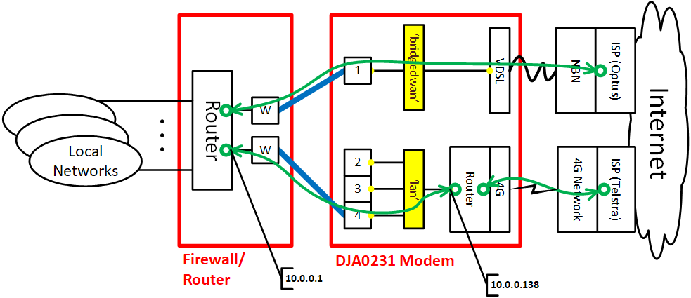
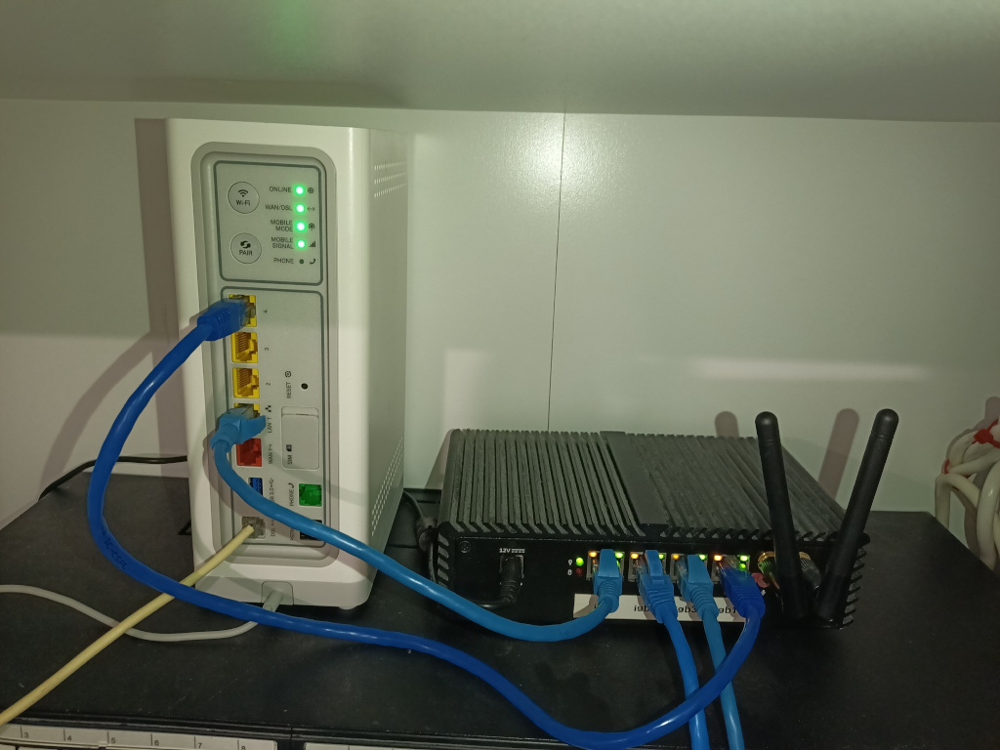
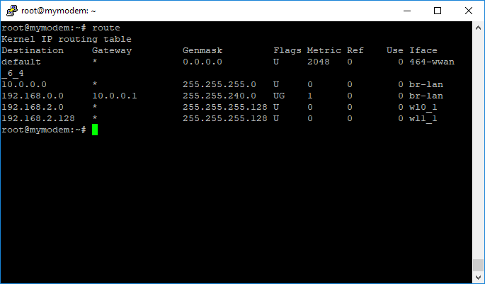
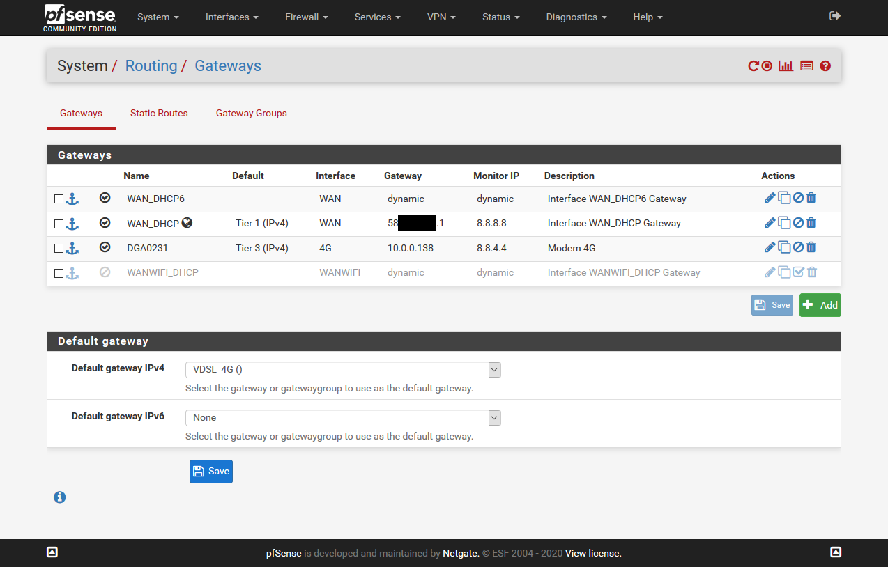
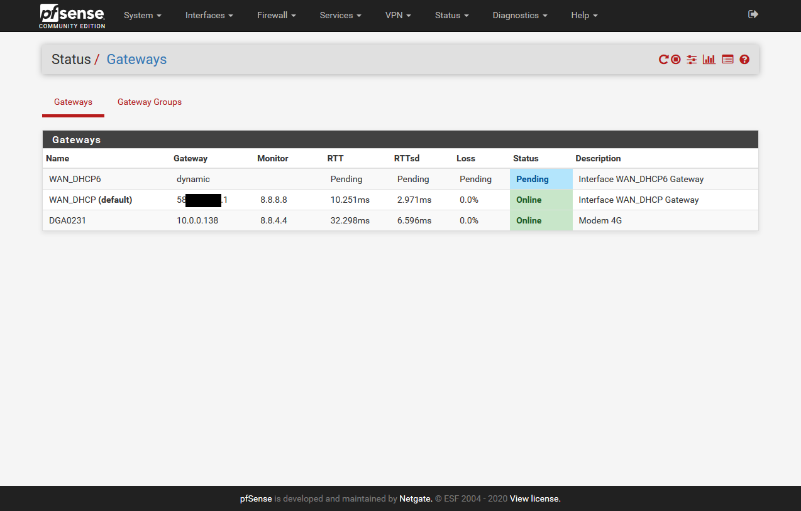

# Unlock Functionality

!!! important "Do not SKIP!"
    !!! warning "WARNING"
        This process is not supported by the manufacturer or supplier of your Gateway.
    !!! danger "DANGER"
        The process could break your Gateway or reduce its security allowing other people into your network. Anyone following this guide accepts full responsibility for the outcomes.

## Custom GUIs

### tch-nginx-gui

A highly universal custom GUI with tons (!) of features is [available here](https://github.com/Ansuel/tch-nginx-gui). If you encounter any issues after installing this mod, please open a [GitHub issue here](https://github.com/Ansuel/tch-nginx-gui/issues) to ask for support.

This is recommended for users who don't fear a few bugs and want the most out-of-box usability from their modded gateway.

!!! info "Recovery options"
    Since version `9.5.60` this mod is compatible with the same *optimal* bank plan suggested in this wiki. Please, read Recovery page carefully and get familiar with recovery strategies available when this special planning is in order. The easy and reliable Recovery for optimal bank plan users will also be available for you.

!!! info "Different RTFD behavior"
    Any RTFD attempt will not uninstall this mod completely. Since version `9.5.60` you will need to repeat RTFD two times in a row to bring back the gateway to the same state a normal RTFD would.

!!! danger "This mod has permanently bricked Gateways before"
    In older versions of this GUI, it has bricked low space devices like the TG799vac.
    It now has a brick prevention method in place so this is not so much of a worry.
    Do not use versions older than `9.5.60`.

### tch-gui-unhide

Another GUI modification option for Telstra branded devices _only_ (especially Telstra Smart Modems) running firmware version 17.2 and later is [available here](https://github.com/seud0nym/tch-gui-unhide). If you encounter any issues after installing this mod, please open a [GitHub issue here](https://github.com/seud0nym/tch-gui-unhide/issues) to ask for support. 

Because this GUI modification is limited to Telstra branded devices, there are very few bugs. It exposes all of the hidden GUI cards and adds a few unique features like DNS hijacking and package management.

## Utility Scripts

[This](https://github.com/seud0nym/tch-gui-unhide/tree/master/utilities#readme) Github repository contains many utility scripts to simplify maintenance and add features to Technicolor devices.

The script names are self-explanatory in most cases:
- [hijack-dns](https://github.com/seud0nym/tch-gui-unhide/tree/master/utilities#hijack-dns)
- [mtd-backup](https://github.com/seud0nym/tch-gui-unhide/tree/master/utilities#mtd-backup)
- [mtd-restore](https://github.com/seud0nym/tch-gui-unhide/tree/master/utilities#mtd-restore)
- [overlay-restore](https://github.com/seud0nym/tch-gui-unhide/tree/master/utilities#overlay-restore)
- [reboot-on-coredump](https://github.com/seud0nym/tch-gui-unhide/tree/master/utilities#reboot-on-coredump)
- [reset-to-factory-defaults-with-root](https://github.com/seud0nym/tch-gui-unhide/tree/master/utilities#reset-to-factory-defaults-with-root)
- [safe-firmware-upgrade](https://github.com/seud0nym/tch-gui-unhide/tree/master/utilities#safe-firmware-upgrade)
- [set-optimal-bank-plan](https://github.com/seud0nym/tch-gui-unhide/tree/master/utilities#set-optimal-bank-plan)
- [set-web-admin-password](https://github.com/seud0nym/tch-gui-unhide/tree/master/utilities#set-web-admin-password)
- [show-bank-plan](https://github.com/seud0nym/tch-gui-unhide/tree/master/utilities#show-bank-plan)
- [transformer-cli](https://github.com/seud0nym/tch-gui-unhide/tree/master/utilities#transformer-cli)
- [unpack-rbi](https://github.com/seud0nym/tch-gui-unhide/tree/master/utilities#unpack-rbi)
- [update-ca-certificates](https://github.com/seud0nym/tch-gui-unhide/tree/master/utilities#update-ca-certificates)

### AdGuard Home

It is possible to install [AdGuard Home](https://github.com/AdguardTeam/AdGuardHome) on Technicolor armv7l or aarch64 devices for blocking ads and tracking. This is done by replacing the functionality normally provided by dnsmasq for DNS resolution. It also replaces dnsmasq/odhcpd for DHCP. 

Your device must have either an armv7l or aarch64 processor (check the output of `uname -m`), and sufficient RAM free. 100Mb free is suggested, but actual RAM used will be dependent upon how many block lists are enabled and how big they are.

The installation will take between 40Mb and 80Mb of storage, excluding logs. However, the install scripts do allow installation on an attached external USB device. 

The installation [script](https://github.com/seud0nym/tch-gui-unhide/tree/master/supplemental/adguard#readme) has options for various deployment scenarios such as internal vs external storage, and retaining dnsmasq/odhcp for DHCP. By default (but optionally), it also installs and configures [hijack-dns](https://github.com/seud0nym/tch-gui-unhide/tree/master/utilities#hijack-dns) to ensure that no devices on the LAN can bypass the defined DNS server.

### EasyMesh

Telstra Smart Modems have Wi-Fi mesh capability, based on the EasyMesh standard. Normally the Smart Modem acts as an EasyMesh controller, providing the internet gateway and handling one or more EasyMesh agents (in Telstra parlance, a "Wi-Fi Booster") to provide a mesh network. The controller also acts as an agent to handle locally connected devices, and the mesh network seamlessly handles hand-over between agents as devices such as Smart Phones move in and out of range of each agent. The Telstra Wi-Fi Boosters can be connected to the main controller via ethernet or wireless. This connection is known as the back-haul.

You can determine if you device has EasyMesh installed by checking for the existence of either `/etc/config/multiap` (for EasyMesh R1 devices) or `/etc/config/mesh_broker` (for EasyMesh R2 devices).

Because the Smart Modem itself can act as an agent, [these scripts](https://github.com/seud0nym/tch-gui-unhide/tree/master/supplemental/wifi-booster#readme) configure a Telstra Smart Modem (Gen 1 and 2 only) to act as an EasyMesh agent to a Telstra Smart Modem (Gen 1 and 2 only) controller using Ethernet back-haul. Note that it is not possible at this time to configure Wi-Fi back-haul, as these devices do not have the software to configure the Wi-Fi to act in station mode to connect wirelessly to the controller, so only direct ethernet connection (or Ethernet-over-Power adapters) are possible.

## Unlock Web GUI Tiles

Tested on Telstra Gateways

!!! info
    The Custom GUI mods above will already expose the extra functionality that these hidden/locked Web GUI tiles contain, so these commands are unnecessary if you have installed one of the custom GUI options.

```bash
# Unlock Web Interface Tiles (Telstra Devices)
uci add_list web.ruleset_main.rules=iproutesmodal
uci set web.iproutesmodal=rule
uci set web.iproutesmodal.target='/modals/iproutes-modal.lp'
uci add_list web.iproutesmodal.roles='admin'
uci add_list web.ruleset_main.rules=systemmodal
uci set web.systemmodal=rule
uci set web.systemmodal.target='/modals/system-modal.lp'
uci add_list web.systemmodal.roles='admin'
uci add_list web.ruleset_main.rules=relaymodal
uci set web.relaymodal=rule
uci set web.relaymodal.target='/modals/relay-modal.lp'
uci add_list web.relaymodal.roles='admin'
uci add_list web.ruleset_main.rules=natalghelpermodal
uci set web.natalghelpermodal=rule
uci set web.natalghelpermodal.target='/modals/nat-alg-helper-modal.lp'
uci add_list web.natalghelpermodal.roles='admin'
uci add_list web.ruleset_main.rules=diagnosticstcpdumpmodal
uci set web.diagnosticstcpdumpmodal=rule
uci set web.diagnosticstcpdumpmodal.target='/modals/diagnostics-tcpdump-modal.lp'
uci add_list web.diagnosticstcpdumpmodal.roles='admin'
sed -e 's/session:hasAccess("\/modals\/diagnostics-network-modal.lp")/session:hasAccess("\/modals\/diagnostics-network-modal.lp") and \n session:hasAccess("\/modals\/diagnostics-tcpdump-modal.lp")/' -i /www/cards/009_diagnostics.lp
sed -e 's^alt="network"></div></td></tr>\\^alt="network"></div></td>\\\n <td><div data-toggle="modal" data-remote="modals/diagnostics-tcpdump-modal.lp" data-id="diagnostics-tcpdump-modal"></div></td></tr>\\^' -i /www/cards/009_diagnostics.lp
sed -e 's/{"logviewer-modal.lp", T"Log viewer"},/{"logviewer-modal.lp", T"Log viewer"},\n {"diagnostics-tcpdump-modal.lp", T"tcpdump"},\n/' -i /www/snippets/tabs-diagnostics.lp
sed -e 's/if currentuserrole == "guest" /if currentuserrole == "admin" /' -i /www/docroot/modals/gateway-modal.lp
uci commit
# Enable Unsigned config export and Firmware upgrade in Web GUI
uci set system.config.export_plaintext='1'
uci set system.config.export_unsigned='1'
uci set system.config.import_plaintext='1'
uci set system.config.import_unsigned='1'
uci set web.uidefault.upgradefw_role='admin'
uci add_list web.parentalblock.roles='admin'
uci commit
```

## Change DNS

This is by far one of the most requested mods.

### Changing the default assigned server from your Gateways IP address to your DNS server

1. Using `vi` or a program like WinSCP edit /etc/config/dhcp
2. Under

```bash
config dhcp 'lan'
```

Add:

```bash
list dhcp_option '6,<dns 1>,<dns 2>'
```

### Redirecting all queries through the gateway to a specific DNS server

1. Using `vi` or a program like WinSCP edit /etc/config/dhcp
2. Under

```bash
config dnsmasq 'main'
```

Add:

```bash
list server '<IP of DNS>'
```

## VoIP Tweaks for Testra firmwares

### Switch from FXO lines to VoIP

If you want to use VoIP, the following is the quickest way to set it up and remove some broken config that causes calls to be sent out via the FXO port which will be unplugged for everyone in Australia, once you are on NBN.

!!! warning
    This code will not work as is for some Gateway / Firmware combinations because their default configurations are different (eg [DJA0230](https://forums.whirlpool.net.au/thread/9vxxl849?p=204#r64998059)). Use:
    ```uci del_list mmpbx.@outgoing_map[*].priority='3' instead of '2'```
!!! warning
    You should _only_ apply these changes if you are experiencing a problem. Recent firmware does not suffer from the problems this code fixes.

```bash
# Block 1
# Edit these lines as required, or use the GUI afterwards to fix the values
uci set mmpbxrvsipnet.sip_profile_0=profile
uci set mmpbxrvsipnet.sip_profile_0.enabled='1'
uci set mmpbxrvsipnet.sip_profile_0.network='sip_net'
uci set mmpbxrvsipnet.sip_profile_0.user_name='UserName0'
uci set mmpbxrvsipnet.sip_profile_0.display_name='DisplayName0'
uci set mmpbxrvsipnet.sip_profile_0.password='Password0'
uci set mmpbxrvsipnet.sip_profile_0.uri='Uri0'
uci set mmpbxrvsipnet.sip_net.primary_proxy='primary.proxy.0'
uci set mmpbxrvsipnet.sip_net.user_friendly_name='SIP Network 0'
uci set mmpbxrvsipnet.sip_net.local_port='5070'
uci set mmpbxrvsipnet.sip_net.primary_registrar='primary.registrar.0'
uci set mmpbxrvsipnet.sip_net.primary_proxy_port='5060'
uci set mmpbxrvsipnet.sip_net.reg_expire='3600'
uci set mmpbxrvsipnet.sip_net.primary_registrar_port='5060'
uci set mmpbxrvsipnet.sip_profile_0.enabled='1'
uci set mmpbxbrcmfxsdev.fxs_dev_0.relay_state='1'
uci set mmpbxbrcmfxsdev.fxs_dev_1.relay_state='1'
uci set mmpbxrvsipnet.sip_profile_1.enabled='1'
uci set mmpbxbrcmfxsdev.fxs_dev_0.relay_state='1'
uci set mmpbxbrcmfxsdev.fxs_dev_1.relay_state='1'
uci del_list mmpbx.@outgoing_map[0].profile='fxo_profile'
uci del_list mmpbx.@outgoing_map[0].priority='2'
uci del_list mmpbx.@outgoing_map[1].profile='fxo_profile'
uci del_list mmpbx.@outgoing_map[1].priority='2'
uci del_list mmpbx.@outgoing_map[2].profile='fxo_profile'
uci del_list mmpbx.@outgoing_map[2].priority='2'
uci del_list mmpbx.@outgoing_map[3].profile='fxo_profile'
uci del_list mmpbx.@outgoing_map[3].priority='2'
uci del_list mmpbx.@outgoing_map[4].profile='fxo_profile'
uci del_list mmpbx.@outgoing_map[4].priority='2'
uci del_list mmpbx.@outgoing_map[5].profile='fxo_profile'
uci del_list mmpbx.@outgoing_map[5].priority='2'
uci del_list mmpbx.@outgoing_map[6].profile='fxo_profile'
uci del_list mmpbx.@outgoing_map[6].priority='2'
uci del_list mmpbx.@outgoing_map[7].profile='fxo_profile'
uci del_list mmpbx.@outgoing_map[7].priority='2'
uci del_list mmpbx.@outgoing_map[8].profile='fxo_profile'
uci del_list mmpbx.@outgoing_map[8].priority='2'
uci del_list mmpbx.@outgoing_map[9].profile='fxo_profile'
uci del_list mmpbx.@outgoing_map[9].priority='2'
uci del_list mmpbx.@outgoing_map[10].profile='fxo_profile'
uci del_list mmpbx.@outgoing_map[10].priority='2'
uci del_list mmpbx.@outgoing_map[11].profile='fxo_profile'
uci del_list mmpbx.@outgoing_map[11].priority='2'
uci del_list mmpbx.@outgoing_map[12].profile='fxo_profile'
uci del_list mmpbx.@outgoing_map[12].priority='2'
uci del_list mmpbx.@outgoing_map[13].profile='fxo_profile'
uci del_list mmpbx.@outgoing_map[13].priority='2'
uci del_list mmpbx.@outgoing_map[14].profile='fxo_profile'
uci del_list mmpbx.@outgoing_map[14].priority='2'
sed -e 's/getrole()=="guest"/getrole()=="admin"/' -i /www/snippets/tabs-voice.lp
uci commit
/etc/init.d/nginx restart
/etc/init.d/mmpbxd restart
```

## Expose some more VoIP settings into the web UI

The following commands are only required for older Telstra firmware i.e. `17.2.0188-820-RA` and earlier.  

They aren't required on newer firmware.  Failures can be ignored. Some of the extra tabs exist in the newer firmware but they hang, so they have been left out!

```bash
# Block 2 - most people can skip this
uci add_list web.tvoicecontacts.roles=admin
uci add_list web.tvoicecalllog.roles=admin
uci add_list web.tvoicecapability.roles=admin
uci add_list web.tvoicesipconfig.roles=admin
uci add_list web.ruleset_main.rules=mmpbxinoutgoingmapmodal
uci set web.mmpbxinoutgoingmapmodal=rule
uci set web.mmpbxinoutgoingmapmodal.target='/modals/mmpbx-inoutgoingmap-modal.lp'
uci add_list web.mmpbxinoutgoingmapmodal.roles='admin'
uci add_list web.ruleset_main.rules=mmpbxstatisticsmodal
uci set web.mmpbxstatisticsmodal=rule
uci set web.mmpbxstatisticsmodal.target='/modals/mmpbx-statistics-modal.lp'
uci add_list web.mmpbxstatisticsmodal.roles='admin'
sed -e 's/{"mmpbx-sipdevice-modal.lp", T"Sip Device"},/{"mmpbx-sipdevice-modal.lp", T"Sip Device"},\n{"mmpbx-inoutgoingmap-modal.lp", T"In-Out Mapping"},\n{"mmpbx-statistics-modal.lp", T"Statistics"},/' -i /www/snippets/tabs-voice.lp
uci commit
```

### Change internal VoIP extensions credentials

!!! warning
    This only applies to firmwares with mmpbxrvsipdev support.

 We also reset the LAN SIP inbound passwords here for security.

 Please don't post the default passwords in public forums as they could be a security risk for those still using them!

```bash
uci set mmpbxrvsipdev.sip_dev_0.password=`dd if=/dev/urandom bs=1 | tr -dc A-Za-z0-9 | head -c${1:-10}`
uci set mmpbxrvsipdev.sip_dev_1.password=`dd if=/dev/urandom bs=1 | tr -dc A-Za-z0-9 | head -c${1:-10}`
uci set mmpbxrvsipdev.sip_dev_2.password=`dd if=/dev/urandom bs=1 | tr -dc A-Za-z0-9 | head -c${1:-10}`
uci set mmpbxrvsipdev.sip_dev_3.password=`dd if=/dev/urandom bs=1 | tr -dc A-Za-z0-9 | head -c${1:-10}`
uci set mmpbxrvsipdev.sip_dev_4.password=`dd if=/dev/urandom bs=1 | tr -dc A-Za-z0-9 | head -c${1:-10}`
uci set mmpbxrvsipdev.sip_dev_5.password=`dd if=/dev/urandom bs=1 | tr -dc A-Za-z0-9 | head -c${1:-10}`
uci set mmpbxrvsipdev.sip_dev_6.password=`dd if=/dev/urandom bs=1 | tr -dc A-Za-z0-9 | head -c${1:-10}`
uci set mmpbxrvsipdev.sip_dev_0.push_type='none'
uci set mmpbxrvsipdev.sip_dev_1.push_type='none'
uci set mmpbxrvsipdev.sip_dev_2.push_type='none'
uci set mmpbxrvsipdev.sip_dev_3.push_type='none'
uci set mmpbxrvsipdev.sip_dev_4.push_type='none'
uci set mmpbxrvsipdev.sip_dev_5.push_type='none'
uci set mmpbxrvsipdev.sip_dev_6.push_type='none'
uci delete mmpbxrvsipdev.sip_server.apn_cert_key
uci delete mmpbxrvsipdev.sip_server.apn_interface
```

### VoLTE backup voice service & SMS reception

From firmware `17.2.0406-820-RC` on the DJA0230TLS it is possible to use a 4G/VoLTE enabled SIM card in the Gateway to provide a phone service on the phone ports and to DECT handsets.  

If you have SIP profiles configured, these will be used before the call is routed via the mobile network.  This has been tested with a Telstra 4G SIM; it's unknown if it will work with Vodafone/Optus SIMs due to the internal VoLTE configuration in the 4G module in the Gateway.

VoLTE status is visible under *Advanced > Telephony > VoLTE tab*; SMS messages are under the *Advanced > Mobile > SMS tab*.

```bash
uci set mmpbxmobilenet.mobile_profile_0.enabled='1'
uci set mobiled_device_specific.@device[0].ims_pdn_autobringup='1'
uci set mobiled_sessions.@session[0].activated='1'
uci set mobiled_sessions.@session[0].autoconnect='1'
uci set mobiled_sessions.@session[0].optional='1'
uci add_list web.ruleset_main.rules=ltesms
uci set web.ltesms=rule
uci set web.ltesms.target='/modals/lte-sms.lp'
uci add_list web.ltesms.roles='admin'
uci commit
/etc/init.d/mmpbxd restart
/etc/init.d/nginx restart
```

## Unlocking the option to setup a second SIP network

!!! warning
    mmpbx (the Homeware VoIP stack) support for multiple SIP networks is broken. The SIP message listener for the second network will end up being used for both SIP networks. Effects of this issue will vary according to specific VoIP deployments and settings in ways we couldn't really predict in general. You can install and use sngrep application to better diagnose these weird situations. Please note multiple profiles for the same SIP network are working fine. You can still get better results by setting up a single local Asterisk PBX and connect mmpbx to it as a single network with multiple profiles.

```bash
# Block 3A (Optional: Adding 2nd SIP Provider)
uci set mmpbx.sip_net_1=network
uci set mmpbx.sip_net_1.config='uci set mmpbxrvsipnet'
uci commit
uci set mmpbxrvsipnet.sip_net_1=network
uci set mmpbxrvsipnet.sip_net_1.session_expires='180'
uci set mmpbxrvsipnet.sip_net_1.no_answer_response='480'
uci set mmpbxrvsipnet.sip_net_1.dtmf_relay_translation='0'
uci set mmpbxrvsipnet.sip_net_1.call_waiting_reject_response='486'
uci set mmpbxrvsipnet.sip_net_1.cac='-1'
uci set mmpbxrvsipnet.sip_net_1.ingress_media_timeout='1000'
uci set mmpbxrvsipnet.sip_net_1.timer_D='50000'
uci set mmpbxrvsipnet.sip_net_1.privacy_handling='apply'
uci set mmpbxrvsipnet.sip_net_1.timer_J='32000'
uci set mmpbxrvsipnet.sip_net_1.reliable_provisional_response='supported'
uci set mmpbxrvsipnet.sip_net_1.transparent_soc_transmission='0'
uci set mmpbxrvsipnet.sip_net_1.switch_back_to_primary_proxy_timer='0'
uci set mmpbxrvsipnet.sip_net_1.transport_type='UDP'
uci set mmpbxrvsipnet.sip_net_1.control_qos_field='dscp'
uci set mmpbxrvsipnet.sip_net_1.timer_T4='5000'
uci set mmpbxrvsipnet.sip_net_1.realtime_qos_field='dscp'
uci set mmpbxrvsipnet.sip_net_1.escape_hash='1'
uci set mmpbxrvsipnet.sip_net_1.dtmf_relay='auto'
uci set mmpbxrvsipnet.sip_net_1.realtime_qos_value='af42'
uci set mmpbxrvsipnet.sip_net_1.fail_behaviour='stop'
uci set mmpbxrvsipnet.sip_net_1.escape_star='0'
uci set mmpbxrvsipnet.sip_net_1.timer_F='32000'
uci set mmpbxrvsipnet.sip_net_1.primary_proxy_port='5060'
uci set mmpbxrvsipnet.sip_net_1.realm_check='0'
uci set mmpbxrvsipnet.sip_net_1.reg_expire='3600'
uci set mmpbxrvsipnet.sip_net_1.reg_back_off_timeout='180'
uci set mmpbxrvsipnet.sip_net_1.secondary_proxy_port='0'
uci set mmpbxrvsipnet.sip_net_1.timer_B='32000'
uci set mmpbxrvsipnet.sip_net_1.uri_clir_format='standard'
uci set mmpbxrvsipnet.sip_net_1.reg_expire_T_before='1'
uci set mmpbxrvsipnet.sip_net_1.re_registration_mode='standard'
uci set mmpbxrvsipnet.sip_net_1.timer_T1='500'
uci set mmpbxrvsipnet.sip_net_1.call_waiting_provisional_response='182'
uci set mmpbxrvsipnet.sip_net_1.forking_mode='default'
uci set mmpbxrvsipnet.sip_net_1.interface='wan'
uci set mmpbxrvsipnet.sip_net_1.session_timer='enabled'
uci set mmpbxrvsipnet.sip_net_1.control_qos_value='ef'
uci set mmpbxrvsipnet.sip_net_1.secondary_registrar_port='5060'
uci set mmpbxrvsipnet.sip_net_1.min_period_proxy_redundancy='0'
uci set mmpbxrvsipnet.sip_net_1.min_session_expires='90'
uci set mmpbxrvsipnet.sip_net_1.primary_registrar_port='5060'
uci set mmpbxrvsipnet.sip_net_1.timer_T2='4000'
uci set mmpbxrvsipnet.sip_net_1.rport_in_via='1'
uci set mmpbxrvsipnet.sip_net_1.provisional_timer='180'
uci set mmpbxrvsipnet.sip_net_1.rejection_response='486'
uci commit
uci set mmpbxrvsipnet.sip_net_1.primary_proxy='primary.proxy.1'
uci set mmpbxrvsipnet.sip_net_1.user_friendly_name='SIP Network 1'
uci set mmpbxrvsipnet.sip_net_1.local_port='5071'
uci set mmpbxrvsipnet.sip_net_1.primary_registrar='primary.registrar.1'
uci set mmpbxrvsipnet.sip_net_1.domain_name='domain.name.1'
uci commit
/etc/init.d/nginx restart
/etc/init.d/mmpbxd restart
```

Setting SIP profiles which can be easily edited via GUI for multiple accounts per VoIP provider

```bash
# SIP Account defaults
# Edit these lines as required, or use the GUI afterwards to fix the values
uci set mmpbxrvsipnet.sip_profile_1=profile
uci set mmpbxrvsipnet.sip_profile_1.enabled='1'
uci set mmpbxrvsipnet.sip_profile_1.network='sip_net_1'
uci set mmpbxrvsipnet.sip_profile_1.user_name='UserName1'
uci set mmpbxrvsipnet.sip_profile_1.display_name='DisplayName1'
uci set mmpbxrvsipnet.sip_profile_1.password='Password1'
uci set mmpbxrvsipnet.sip_profile_1.uri='Uri1'
uci set mmpbxrvsipnet.sip_profile_2=profile
uci set mmpbxrvsipnet.sip_profile_2.enabled='1'
uci set mmpbxrvsipnet.sip_profile_2.network='sip_net'
uci set mmpbxrvsipnet.sip_profile_2.user_name='UserName2'
uci set mmpbxrvsipnet.sip_profile_2.display_name='DisplayName2'
uci set mmpbxrvsipnet.sip_profile_2.password='Password2'
uci set mmpbxrvsipnet.sip_profile_2.uri='Uri2'
uci set mmpbxrvsipnet.sip_profile_3=profile
uci set mmpbxrvsipnet.sip_profile_3.enabled='1'
uci set mmpbxrvsipnet.sip_profile_3.network='sip_net_1'
uci set mmpbxrvsipnet.sip_profile_3.user_name='UserName3'
uci set mmpbxrvsipnet.sip_profile_3.display_name='DisplayName3'
uci set mmpbxrvsipnet.sip_profile_3.password='Password3'
uci set mmpbxrvsipnet.sip_profile_3.uri='Uri3'
uci commit
```

## Enable VOIP for both SIP providers while on 4G Backup (Frontier DJN2130 & SMG1 DJA0230)

!!! warning
    This is not a general trick. It depends on other special firmware settings about VoIP routing and NAT rules.

```bash
# Enable VOIP while on backup
uci set mmpbxrvsipnet.sip_net.interface='lan'
uci set mmpbxrvsipnet.sip_net.interface6='lan6'
uci set mmpbxrvsipnet.sip_net_1.interface='lan'
uci set mmpbxrvsipnet.sip_net_1.interface6='lan6'
uci commit
/etc/init.d/nginx restart
```

## xDSL modem tweaks

These tweaks only apply to Homeware gateways with an integrated xDSL modem.

!!! note "xDSL drivers"
    There exist multiple xDSL drivers versions across different firmwares. You can observe differences in stability and/or performance moving from devices based on older xDSL SoC to newer ones. If you think you really need some specific xDSL driver version, you can switch it by picking compatible blobs from other firmwares. The tch-nginx-gui provides an user-friendly way to play with such things.

### Speeding up VDSL sync times

If you're on VDSL you may be able to speed up your sync times by removing redundant DSL profiles so the integrated Gateway does not even try to use them.

**Don't do this if you're still on ADSL!**

```bash
uci del_list xdsl.dsl0.profile='8a'
uci del_list xdsl.dsl0.profile='8b'
uci del_list xdsl.dsl0.profile='8c'
uci del_list xdsl.dsl0.profile='8d'
uci del_list xdsl.dsl0.profile='12a'
uci del_list xdsl.dsl0.profile='12b'
uci del_list xdsl.dsl0.multimode='gdmt'
uci del_list xdsl.dsl0.multimode='adsl2annexm'
uci del_list xdsl.dsl0.multimode='adsl2plus'
uci commit
reboot
```

If you wish to add the selections to the web interface to play with later, you can run the following:

```bash
uci add_list web.ruleset_main.rules=xdsllowmodal
uci set web.xdsllowmodal=rule
uci set web.xdsllowmodal.target='/modals/xdsl-low-modal.lp'
uci add_list web.xdsllowmodal.roles='admin'
uci commit
/etc/init.d/nginx restart
```

## Turning off Power-Saving features

In theory, by turning off all power-saving features, the gateway should be more responsive in every way. To do this

1. Log in via SSH to your gateway
2. Run these commands:

```bash
pwrctl config --cpuspeed 0
pwrctl config --wait off
pwrctl config --ethapd off
pwrctl config --eee off
pwrctl config --autogreeen off
```

## Running the Homeware gateway as router with a second router behind it (Double NAT)

Double NAT used to break many things, but testing with this configuration shows that most current applications are very tolerant of it. Most applications assume they are on a private network and that their visible IP is not the one they are visible on on the internet via, so if it's nested one more level down via NAT with a DMZ redirecting traffic to the second router's WAN interface it makes very little difference (if this guide is followed)!

There are many reasons you would want to do this:

- You have a complex network setup with a more advanced router running services such as a VPN server and you still want to use the VoIP in the TG799vac so that it can manage the packet priority tagging properly.

- You don't quite trust the TG799vac.

- You want a simpler solution than the 'Using bridge mode with a dedicated PPPoE ethernet port' section below outlines which can be a nightmare to set up and debug if something goes wrong.

- You want easy access to the TG799vac GUI so you can get sync speeds etc at the gateway's IP. This is still possible in bridged mode but it's less straight forward.

- You want to hack the TG799vac with alternate network access if you corrupt the hacked gateway.

Here is how you go setting this up properly:

1. Set up the TG799vac as above fully including VoIP etc and make sure it works to your satisfaction.

2. The TG799vac's default LAN IP on Telstra firmware is `10.0.0.138` and subnet mask `255.255.255.0`. If your inner router also has a default LAN subnet of `10.0.0.0` then it's advised to change one of them (probably the TG799vac so your network will not be disrupted) to a subnet of your choosing such as `10.0.100.0` subnet mask `255.255.255.0`. The rest of this section assumes you moved the TG799vac's LAN IP to `10.0.100.1` subnet mask `255.255.255.0`

3. Add a 'static lease' on the TG799vac under Advanced -> Local Network -> Static Leases with your internal router's WAN MAC address and a suitable ip such as `10.0.100.2`.

4. Connect your inner router's WAN port to one of the TG799vac's LAN ports.

5. Confirm on the inner router that it got `10.0.100.2` as the WAN IP. If it did not, reboot both of them at the same time to get rid of any lingering DHCP leases. If that fails re-check the MAC address of the lease handed out from the TG799vac.

6. On the TG799vac under Advanced -> WAN Services -> DMZ enable it and set the IP to `10.0.100.2` Set up DynDNS if you want to. Save.

7. Turn off WiFi on the TG799vac.

At this point the TG799vac should be transparent to incoming requests which will hit the WAN interface of your internal router and be handled normally.

## Keep WWAN functionality while Homeware gateway is bridged

Those who are using a Homeware gateway in "bridge modes" would normally have all (or almost all) other features disabled or unused.  That is, they just want to bridge the main WAN interface (modem, ethernet, ont, cable, ...) connection to a LAN Ethernet interface that their main router/firewall connects to. However, these Homeware gateways also supports cellular  interfaces for failover purposes which could be still utilised by the router/firewall in a multi-WAN (fixed and cellular) configuration. You might also want to do this if you are not happy with native 4G failover behavior implemented by Technicolor, for example it does not cutover quickly enough, leaving long periods of no internet connectivity.

### In this example

1. We're going to use a DJA0231 from Telstra, although other gateways with external 4G USB dongles should also work.
2. The modem interface has been configured to be bridged to LAN1 Ethernet port.
3. The main WAN connection is going to be over VDSL with DHCP. Other WAN types like Ethernet over PPPoE would also work with small modifications to interface names used to the config.
4. For simplicity, we're going to dedicate two distinct LAN ports to main and cellular WAN connections. It is possible to use a single one with proper VLAN setup.

### Confirm bridge mode is working

You need to be sure main WAN bridging is configured and working correctly. Configure your main router for DHCP WAN and plug it directly into the bridged one of the gateway's LAN ports. If configured correctly, the main router will get an IP address from your ISP. Plug your PC to an unbridged LAN port or connect via Wi-Fi so that you can continue to configure the gateway.

!!! warning "Bridge mode of tch-nginx-gui"
    The tch-nginx-gui mod allows the gateway to be configured into a so-called "bridge mode", but unlike the native Telstra code, is not a one-step press the "bridge Mode" button procedure and can be picky in the order in which things are done. However, the advantage tch-nginx-gui has is that it leaves much of the features intact and allows you to reverse it without doing a factory reset.

The following diagram shows what we are trying to achieve.



In the diagram above the IP layer connections are green with the green circles representing terminating IP addresses. The VDSL modem is bridged at layer 2 through the switch LAN port 1 and the Homeware gateway is effectively invisible from an layer 3 (IP) perspective. On the 4G path, the IP connection terminates on the router in the gateway. This will create a double NAT (firewall/router and DJA0231 modem) path from your home network towards the cellular WAN. Of course, you may still add a static NAT rule or setup static routes to avoid this if you prefer, like we will explain later on.

This example will allocate dedicated *LAN port 1* (`eth0`) for the bridged VDSL connection, while leaving the other ports on the existing LAN segment to allow connection to the gateway as router hop for the 4G connection and Homeware gateway administration. In this example the gateway's LAN IP address is `10.0.0.138` and on the firewall/router side the IP address is `10.0.0.1`.

### Disable `wansensing` service

We need to stop Homeware from doing automatic detection of WAN state which causes the 4G to be brought down if it detects the main WAN interface is up.

```bash
# Check status
/etc/init.d/wansensing enabled && echo wansensing is currently ENABLED

# Disable service and confirm status
/etc/init.d/wansensing disable
/etc/init.d/wansensing enabled || echo wansensing is currently DISABLED

# Stop service
/etc/init.d/wansensing stop
```

### Enable `wwan` interface

The 4G interface `wwan` needs to be enabled.

```bash
# Check status
uci show network.wwan.enabled

# Enable wwan
uci set network.wwan.enabled=1
uci show network.wwan.enabled
uci commit network

# reload config files
/etc/init.d/network reload
```

### Change `/etc/config/network` settings

LAN port 1 and the VDSL modem interface need to be removed from the existing `lan` interface if they have been somehow added in there. This usually happens when you use one-touch "bridge modes". You can use WinSCP to easily perform the modifications to `/etc/config/network`. Under the section `config interface 'lan'` remove the following lines (if any):

```
    list ifname 'eth0'
    list ifname 'ptm0' # or eth4 for Ethernet WAN, or whatever different name in case of VLAN interfaces
```

Now we need to add a new interface `bridgedwan` for the bridged VDSL segment.  Add the following just after the `config interface 'lan'` section:

```
config interface 'bridgedwan'
	option force_link '1'
	option type 'bridge'
	list ifname 'eth0'
	list ifname 'ptm0' # or eth4 for Ethernet WAN, or whatever different name in case of VLAN interfaces
```

After saving `/etc/config/network` apply the new config with the following commands:

```bash
uci commit network
/etc/init.d/network reload
```

### Update static routes

If you preferred not to enable a second NAT on your main router towards the cellular WAN, the Homeware gateway (used as router for 4G WAN) needs to know the existence of your downstream local networks, otherwise it does not know how to get the packets back to your devices. This can be done either directly from inside `/etc/config/network` or via the *IP Extras* card in the WebUI. The values you put here will be specific to your local IP environment. The example below will cater for networks from `192.168.0.0` to `192.168.15.0`.

- IP Extras
  - IPv4 Static Routes Configuration 
    - Press `Add new static IPv4 route` button
    - Enter the following values:
      - Destination: 192.168.0.0
      - Mask: 255.255.240.0
      - Gateway: 10.0.0.1
      - Metric: 1
      - Interface: LAN

### What it looks like when its working

Below are some pictures and screenshots of the Homeware gateway used in a multi-WAN environment with a PfSense firewall as main router with NAT disabled over 4G WAN interface.



In the picture above the firewall's far left Ethernet port is used to connect to the bridged VDSL path, while the far right Ethernet port is used to connect to the routed 4G path.



The screen capture above shows the IP routes in the Homeware gateways. You can see only a single default route pointing to the 4G interface and a static route pointing to the local networks we added to avoid double NAT. The bridged VDSL path cannot be seen as it is invisible from a layer-3 IP viewpoint.




The screen captures above show the PfSense firewall using the two WAN links from the Homeware gateway. On the first screen capture you can see that the VDSL connection and the 4G connection are defined as the gateway group `VDSL_4G` with the VDSL connection having a higher priority. On the second screen capture you can see that the firewall sees both WAN interfaces as online allowing it to direct traffic as it sees fit.
