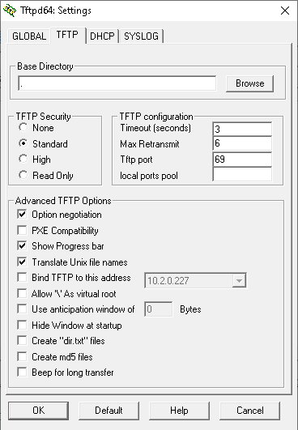
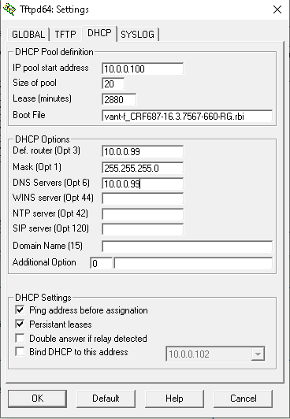

#################################################################################################################################################################################################

## IMPORTANT: Warning
This guide is based upon devices being in the following state:

- TG789vac - orange status light and rebooting every now and then
- TG799vac - orange status light on and occasional rebooting
- TG800vac - green power light only.

**Before power down or reboot/rtfd you must SSH to device and run `mtd erase -r rootfs_data` (or other name of data partition) or your modem is bricked forever.**

**Make sure to follow the steps in order!**

#################################################################################################################################################################################################

## 1. Reset to Factory Defaults

If at some point you can no longer connect to the Gateway or you want to make a fresh install, it may be useful to perform a reset to factory defaults.

Note: *A reset to factory default settings deletes all configuration changes you made. After the reset a reconfiguration of your Gateway will be needed and wireless clients will also have to be re-associated.*

Choose between:
1. Resetting the Gateway via the web interface
2. Reset the Gateway via the Reset button

#### Resetting the Gateway via the web interface:

1. Browse to the Gateway web interface.
2. Click Gateway. The Gateway page appears.
3. Click Reset.
4. The Gateway restores the factory default configuration and restarts.

#### Reset the Gateway via the Reset button:
1. Make sure the Gateway is turned on.
2. Push the Reset button for at least 7 seconds and then release it.
3. The Gateway will restart.

Note: *The physical reset button of the gateway may have been disabled. In this case, a hardware reset to defaults is not possible.*

#### Restore your settings.

If you previously backed up your configuration, you can now restore this configuration to your Gateway.

#################################################################################################################################################################################################

## 2. TFTP Recovery

After soft bricking both my TG789vac and TG800vac modems and finally getting them working again, this guide should help others who are in the same situation. 

It may also work for other models such as the TG799vac.

**What you will need**

1. TFTP64 or similar program

2. RBI firmware file for your device (I suggest using the one that was on it at time of bricking)

3. A static IP address assigned to your wired NIC

4. A network cable

5. A few cups of coffee

6. About 30min to an hour

#################################################################################################################################################################################################

### Set up TFTP

#### Background

Since basically forever, Technicolor modems have had a corrupt firmware recovery mechanism built in.  

By holding down a few buttons at power on on the modem, with the appropriate software running on your PC, you can reload firmware into one of the banks of the modem, usually bank1. (no one has observed it writing to bank2).  

Please note:
- This will not allow you to swap banks, but if both firmware banks are corrupt it will allow recovery. 
 
- Flashing via this method does not perform a factory reset.
  
- The firmware image is digital signature verified so you can't load an incorrect image (a good thing) but you also can't load a modified image (sad face times 1000).

This guide is written for Windows but it should work on Linux too if you adapt the configuration.

#################################################################################################################################################################################################

#### Requirements

- A computer running a DHCP server and TFTP server.  We will use TFTPD64.

- A wired Ethernet connection from your PC to your modem.  Wireless will not work.  You can use wireless to keep an internet connection working while doing this procedure as if you only have one Ethernet port it will be dedicated to the procedure.

- You may need to reconfigure your network card settings for this procedure then restore them later.  This is not covered in this guide.

#################################################################################################################################################################################################

### Setting up the Server

1. Download the latest normal edition of [TFTP64](http://tftpd32.jounin.net/tftpd32_download.html) and install it.

- Get the [firmware](https://whirlpool.net.au/wiki/hw_model_1622) (.rbi) file you want to load into the modem and place it in the TFTP64 folder.  You may use another folder and change the settings appropriately if you wish.

- Connect the Ethernet port on your PC to one of the LAN ports on the modem (usually LAN1).

- Turn the modem off.

- On the PC ensure the network card you wish to use is set to DHCP: 

- Press Windows+R to run `ipconfig /all | find "DHCP Enabled"` or check multiple cards with `ipconfig /all`. [Microsoft help](https://support.microsoft.com/en-us/help/15089/windows-change-tcp-ip-settings). 
(Unless you are using Static IPs on your network this will already be done.  After the next few steps, the network card will receive an address from the TFTPD64 DHCP server.)

- Start TFTP64 as ADMINISTRATOR.

- Click Settings.

- On the GLOBAL tab enable only the following: TFTP Server, DHCP Server.

- On the TFTP tab the default options should be OK (base directory should be `.` )

- On the DHCP Server tab: 

	- 	IP pool start address 10.0.0.100

	-	Size of pool: 20

	-	Boot file: the firmware filename to flash i.e. vant-f_CRF687-16.3.7567-660-RG.rbi

	-	Def Router (Opt 3): 10.0.0.99

	-	Mask (Opt 1): 255.255.255.0

	- 	DNS Servers (Opt 6): 10.0.0.99

- Check against:

- Click OK

- Accept the you will need to restart message.

- On the main screen Change the 'Server Interfaces' selection to your Ethernet network card.

- Close TFTPD64.

- Re-open TFTPD64 as ADMINISTRATOR.

- If you get a firewall warning, allow access on private and public networks.

- The server interface should now show an IP in the 10.0.0.x range and after a few seconds: the PC gets an IP from the TFTP64 program via DHCP.

You are now ready to try booting the modem to do the flash!

#################################################################################################################################################################################################

### Flashing the Firmware

** Required steps **

1. Set up TFTP to send firmware in BOOTP mode, please initially see above, or [this guide](https://www.jonathandavis.me.uk/2013/12/flashing-generic-firmware-on-a-technicolor-tg582n/).

2. Ensure TFTP is on the log viewer tab.

3. Connect one end of the network cable to any LAN port on the modem DO NOT use the WAN port, and the other end to the nic on the pc.

4. Place modem into BOOTP mode, this is achieved by turning modem off, holding the reset button down and powering on.
	- For TG789vac and TG799vac wait for the ethernet light to flash.
	- For TG800vac count to about 5.
	- TFTP may detect the sooner though.

5. Let the firmware flash, and allow modem to reboot.
	- It may take a few attempts for TFTP to connect and send the firmware, and you may have to put the modem into BOOTP mode several times.
	

6. After modem has rebooted, wait for approx 4-10min, modem may reboot several times.

7. Hold down reset button for 15-20 seconds and release.

8. Allow modem to reboot and wait for approx 5min.
	- On the TG800vac you will know it has worked as the online light should be green, for the TG789 there may be some led activity but cant remember.
	

9. Place the modem back into BOOTP mode & flash again & allow modem to reboot. (give it a few minutes)

From here modem should have recovered from its soft-brick state, and be operational again if everything went smoothly. If for some reason you are not recovered, you can try running the process again and see if you recover.

**If successful, remember to un-assign your static ip address.**

**A few things to note:**

- TFTP does not always play nice & may require a few loads to get working, as well as mentioned above, bootp mode can be a pain.

- This guide and process may not work for everyone, depending on their brick state.

- If you have no success with the current firmware, try a different revision

- If all else fails and you cant recover or get stuck, jump over to the [thread](https://forums.whirlpool.net.au/forum-replies.cfm?t=2650998) for help.

#################################################################################################################################################################################################

## 3. Bank Switching

#################################################################################################################################################################################################

### Manually

e.g. If the DJN2130 Telstra Frontier Gateway has v17.2.0261-820-RA loaded it may still be possible to reverted it back to 16.3 using the timed reset method, then exploited via the ping exploit (from [TG799vac process](https://forums.whirlpool.net.au/archive/2650998#r55075373) and [DJN2130](https://forums.whirlpool.net.au/forum-replies.cfm?r=55792167#r55792167)).

The sequence is (Minutes:Seconds):

|Step |	Period     | Time   |	Action
|-----|:-----------|:-------|:--------------------------------------------------
| 0	  |    0	   |  0	    | Power on
| 1	  |00:35	   |  00:35	| Press reset
| 2	  |00:11	   |  00:46	| Release
| 3	  |00:47	   |  01:33	| Press reset
| 4   |00:11	   |  01:44	| Release
| 5	  |00:47	   |  02:31	| Press reset
| 6	  |00:11	   |  02:42	| Release
| 7	  |00:50	   |  03:32	| Press reset
| 8	  |00:11	   |  03:43	| Release
| 9	  |06:00	   |    -    | Browse to 192.168.0.1 and confirm firmware version

#################################################################################################################################################################################################

### Potentiometer

**You will need** 

- A 3 watt and 100 Ohm Potentiometer 

You only use the middle and outside poles and you split the positive cable to the middle pole from the power supply then the outside right pole looking down at the 3 poles from the knob side to the plug going to the modem.

Once powered on around 10-15 seconds into the boot cycle you want to turn it around 1/3 turn and just a little more and wait for the led to flash blue then turn it back up and do this 3 times then it will boot on other bank.

#################################################################################################################################################################################################

### Monitor Serial Console

A Python program written by Mark Smith is available at [GitHub](https://github.com/mswhirl/bouncer) that you can run on a Raspberry Pi which can monitor the serial console output from the modem and then automatically cycle the power to the modem to cause a brown-out condition during boot, to reliably force a temporary bank switch. 

Please see the pictures for the physical setup, and the comments at the top of bouncer.py for more technical details (it may require timing tweaks for different models).

If you do any electronics and have some relays and transistors lying around, you probably already have everything required for this just lying around!

